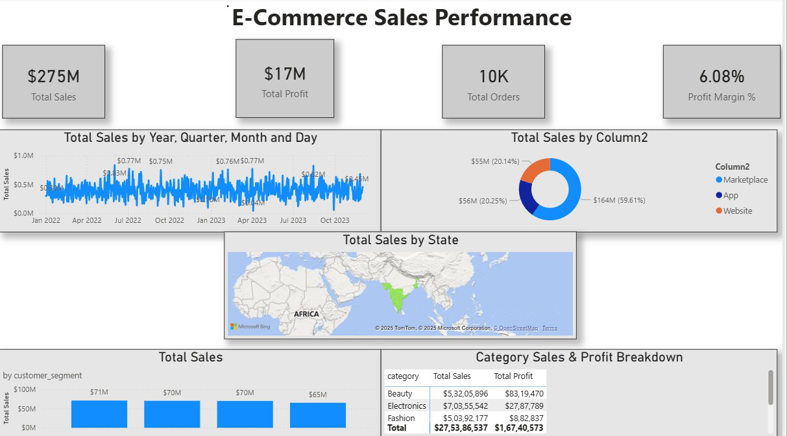

# 📦 E-Commerce Sales Analytics — Power BI & SQL Project (Data Analyst Portfolio)

An end-to-end **Data Analytics** project using **SQL, Power BI, Power Query, DAX, and Excel** to analyze sales performance, customer behavior, and product trends for an e-commerce business.

This project demonstrates complete Data Analyst workflow:
**data cleaning → SQL queries → data modeling → DAX → dashboard → insights.**

---

## 🔧 Tech Stack
- **SQL**
- **Power BI Desktop**
- **Power Query (ETL)**
- **DAX (Measures & KPIs)**
- **Excel**
- **Data Modeling (Star Schema)**

---

## 🚀 Project Overview

This dataset contains e-commerce sales transactions including:
- Customer demographics  
- Order details  
- Product information  
- Regional and city-level sales  
- Category insights  
- Profit metrics  

The goal of this project is to identify:
- Top-performing regions  
- Best-selling categories  
- Customer segment trends  
- Revenue & profit distribution  
- Order growth patterns  

---

## 🧩 Business Problem

E-commerce businesses face difficulties in:
- Understanding customer behavior  
- Identifying profitable categories  
- Tracking yearly and monthly sales trends  
- Managing regional performance  
- Finding repeat customer patterns  

This project builds a dashboard that solves these issues.

---

## 🎯 Project Goals / Deliverables

- Build a clean **ETL pipeline** through Power Query  
- Design a **star schema model** for analytics  
- Create **custom DAX metrics** for KPIs  
- Build a **2-page interactive dashboard**  
- Generate **business insights** for decision-making  

---

## 🔹 Dashboard Pages

### **Page 1 — Sales Performance**
- Total Sales  
- Total Profit  
- Total Orders  
- Profit Margin %  
- Sales by Platform (App / Website / Marketplace)  
- Sales Trend Over Time  
- Sales by Customer Segment  
- Category-wise Sales & Profit  
- Sales by State (Map Visual)  

### **Page 2 — Customer & Category Insights**
- City-wise Sales + Profit  
- Customer Segment Analysis  
- Category Breakdown  
- Top Product Insights  
- Custom tooltips for additional detail  

---

## ⚙ SQL Queries Used

SQL file included:  
`Ecommerce_Sales_Queries.sql`

Contains:
- Data cleaning queries  
- Filtering  
- Aggregations (SUM, COUNT, AOV)  
- Category-wise analysis  
- Segment-level insights  
- Trend queries  

---

## 🧮 DAX Measures Used

Some important measures:
```
Total Sales = SUM(Sales[Total_Sales])
Total Profit = SUM(Sales[Total_Profit])
Profit Margin % = DIVIDE([Total Profit], [Total Sales])
Total Orders = DISTINCTCOUNT(Sales[Order_ID])
AOV = DIVIDE([Total Sales], [Total Orders])
```

(Full DAX list in Power BI file.)

---

## 📁 Project Files

| File | Description |
|------|-------------|
| `Ecommerce_Sales_Analytics_Project.pbix` | Power BI dashboard file |
| `Ecommerce_Sales_Dashboard.pdf` | Exported dashboard (both pages) |
| `Ecommerce_Sales_Queries.sql` | SQL analysis queries |
| `Dataset/` | Raw data files used |
| `Images/page1.png` | Dashboard Page 1 |
| `Images/page2.png` | Dashboard Page 2 |

---

## 📸 Dashboard Preview

### **Page 1 – Sales Performance**


### **Page 2 – Customer & Category Insights**


---

## 📈 Key Insights

- **Marketplace platform** generates the highest revenue  
- **Consumer segment** dominates sales  
- **Electronics** is the biggest sales category  
- **West & South regions** show strong performance  
- **Profit margin stabilizes around ~6%**  
- **Repeat customer rate improving steadily**  
- **City-level insights** show high performance in Bengaluru, Hyderabad & Mumbai  

---

## ▶ How to Explore

1. Download the `.pbix` file  
2. Open it in **Power BI Desktop**  
3. Interact with slicers, tooltips, and visuals  
4. Review SQL insights from the `.sql` file  

---

## 👤 Author

### **G. Shyam Venkat**  
**Data Analyst | SQL | Power BI | DAX | Excel | Data Modeling**

🔗 GitHub: https://github.com/shyamcodes-ai  
🔗 LinkedIn: https://www.linkedin.com/in/g-shyam-venkat-304ab536b  

---

⭐ **If you found this project useful, consider giving the repository a star!**
